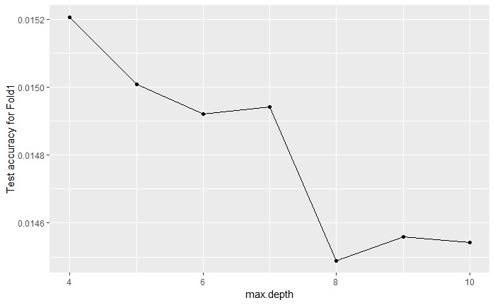
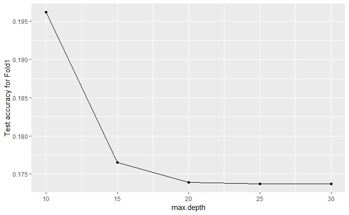

# Boosting

I used fold one to tuned hyperparameters since all other fold has similar performance and using only one fold will save some run time.

## Depth

## nround

Clearly, after around 1300 round, model tends to have some overfitting behavior 

# Random Forest

## Depth

We choose 25 to balance the runtime and accuracy

## Mtry

6 and 8 have really similar behavior, we choose 6

